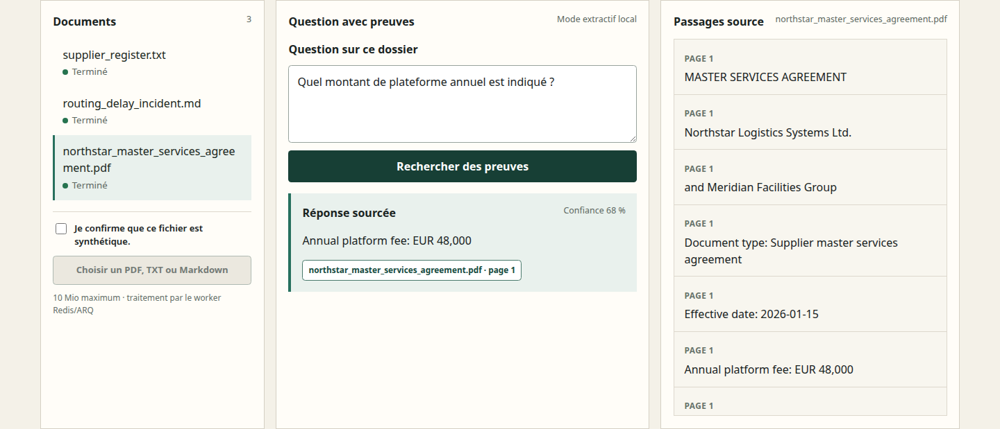
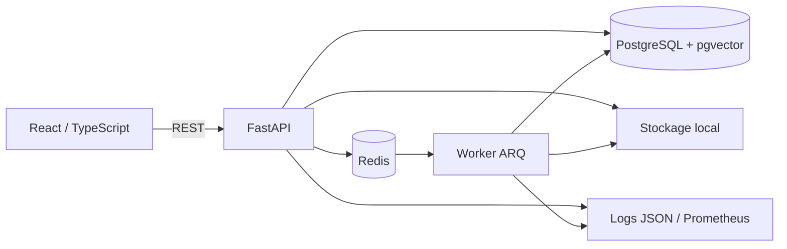

# EvidenceDesk

[Read the synthetic example and its limits](docs/portfolio-walkthrough.md).

EvidenceDesk is a local document review prototype for synthetic supplier records. It ingests files
in the background, links answers to their source passages, and abstains when the available evidence
is missing or contradictory.

> **Research prototype using synthetic data only. Not validated for production, legal, medical,
> financial or compliance decisions.**

## Quick review

- **Stack:** React, TypeScript, FastAPI, PostgreSQL with pgvector, Redis, ARQ and local ONNX
  embeddings.
- **Reviewable flow:** upload, asynchronous processing, cited answers, structured extraction,
  explicit abstention, role checks and correlated audit logs.
- **Evidence:** GitHub Actions runs backend, frontend, secret scanning and a real Docker Compose
  browser path.
- **Published limitation:** the independent v7 holdout reached 100% Recall@5 on answerable cases,
  but only 36% answerable-case accuracy and 45.67% extraction F1. The result remains
  `HONEST_NEGATIVE`.
- **Short path:** start with the [three-minute demo](docs/demo-script.md), then read the
  [career review notes](docs/career-proof.md) and [evaluation details](docs/evaluation.md).

## Présentation détaillée

EvidenceDesk est une plateforme locale de revue de dossiers fournisseurs. Elle importe des PDF texte,
TXT et Markdown synthétiques, les traite hors requête HTTP, extrait des champs traçables et répond
uniquement avec le document, la page et le passage utilisés. Quand la preuve manque ou se
contredit, il doit s'abstenir.

Le projet est une release candidate technique locale, pas un service utilisé par des clients. Le
holdout v7 indépendant a produit un seul lock/raw enregistré après gel et a échoué aux objectifs : le
statut empirique reste `HONEST_NEGATIVE`. Les résultats négatifs et préflights avortés sont conservés
au lieu d'être masqués. Les commits, hashes et locks sont des preuves locales cohérentes, pas un
scellement externe.



## Public visé et parcours

Le scénario local représente une équipe opérations qui vérifie un contrat fournisseur, un rapport
d'incident et un registre. Un administrateur local peut se connecter, observer une tâche Redis/ARQ,
poser une question, ouvrir la citation exacte, consulter l'extraction et le journal d'audit, puis
voir les résultats d'évaluation réellement calculés. L'overlay de démonstration publique n'active
que `demo.analyst` : aucun compte administrateur ou lecteur n'y est disponible.

- `admin` : lecture, import, questions, audit, état, évaluation et suppression ;
- `analyst` : lecture, import et questions ;
- `reader` : lecture, questions et extraction.

Les autorisations sont appliquées par FastAPI ; masquer un contrôle dans React ne remplace jamais
le contrôle serveur.

## Ce qui est réellement implémenté

- FastAPI typé, OAuth2 password flow, JWT de 30 minutes, Argon2 et RBAC serveur ;
- React/TypeScript responsive avec suivi des états, citations et extractions activables au clavier ;
- PostgreSQL 16, `pgvector`, index HNSW, `tsvector` et index GIN ;
- Redis et worker ARQ avec trois tentatives, états terminaux, idempotence par SHA-256 et corrélations ;
- stockage local derrière le protocole `DocumentStorage` ; un adaptateur objet/S3 peut le remplacer ;
- validation extension, signature, MIME, taille, UTF-8 et clé de stockage générée côté serveur ;
- limite du corps HTTP avant parsing multipart, y compris sans `Content-Length` ;
- limitation de débit en mémoire sur authentification, question et import, avec quotas publics plus
  stricts et nombre de clés borné ;
- budgets worker sur pages, caractères extraits et chunks, avec échec terminal explicite ;
- découpage par page/bloc, masquage e-mail/téléphone, extraction fournisseur avec citations par champ ;
- embeddings ONNX locaux, recherche lexicale/dense/hybride, réponse extractive, audit PostgreSQL,
  logs JSON et métriques Prometheus ;
- séparation explicite entre règles système, question utilisateur, document non fiable et preuve,
  avec validation commune des réponses, citations et extractions ;
- Docker Compose, tests pytest/Vitest/Playwright, axe-core et CI GitHub Actions active ;
- corpus synthétique CC0, jeux d'évaluation versionnés, hashes, fingerprint moteur et locks holdout.

Le mode par défaut utilise réellement
`Qdrant/paraphrase-multilingual-MiniLM-L12-v2-onnx-Q` (révision figée, Apache-2.0,
environ 118 M paramètres, vecteurs 384 dimensions) sur CPU avec FastEmbed/ONNX Runtime. Le moteur
`grounded-local-v3` reste déterministe et extractif : EvidenceDesk n'est pas présenté comme un LLM
complet. Le holdout v7 confirme qu'une bonne récupération top-5 ne suffit pas à garantir une bonne
réponse ou extraction.

## Architecture



Le détail des flux, frontières et décisions est dans
[`docs/architecture.md`](docs/architecture.md) et [`docs/decisions/`](docs/decisions/).

## Démarrage Docker

Prérequis : Docker Engine avec Compose v2. Aucun compte ou clé de modèle n'est nécessaire.

```bash
git clone https://github.com/LuxuriantTech/evidencedesk.git
cd evidencedesk
docker compose up --build --wait --wait-timeout 600
docker compose ps
```

Sans dépôt publié, utiliser directement le chemin local de ce projet. L'interface écoute sur
`http://localhost:8080`, l'API sur `http://localhost:8000`, PostgreSQL sur `55432` et Redis sur
`56379`. Ces quatre publications sont liées à `127.0.0.1`, pas aux interfaces LAN.

Le manifeste enregistre un téléchargement modèle mesuré à 266 906 689 octets ; sa durée dépend du
réseau. Docker met ensuite cette couche en cache. Le modèle s'exécute sur CPU ; la reproduction
finale du développement v3 a culminé à `904 192 000` octets de RSS (environ 904 Mo).

Comptes de démonstration locaux :

| Rôle | Identifiant | Mot de passe local |
|---|---|---|
| Administrateur | `demo.admin` | `EvidenceDemo-Admin-2026!` |
| Analyste | `demo.analyst` | `EvidenceDemo-Analyst-2026!` |
| Lecteur | `demo.reader` | `EvidenceDemo-Reader-2026!` |

Ces valeurs sont publiques et réservées à la pile locale synthétique. Elles ne doivent jamais être
réutilisées lors d'un déploiement. Copier [`.env.example`](.env.example) et remplacer tous les
secrets avant toute exposition réseau.

La configuration de démonstration publique sûre se prépare avec l'overlay dédié. Elle exige deux
secrets runtime non versionnés, désactive les comptes administrateur/lecteur, bloque `/metrics`,
conserve l'allowlist synthétique et réduit les quotas :

```bash
cp .env.public-demo.example .env.public-demo
# Remplacer les deux placeholders dans .env.public-demo, puis :
docker compose --env-file .env.public-demo \
  -f compose.yaml -f compose.public-demo.yaml up --build --wait --wait-timeout 600
```

Les ports restent liés à `127.0.0.1`. Rendre cette pile accessible sur Internet exigerait encore un
edge TLS, une limitation partagée multi-instance, une revue d'infrastructure et un GO distinct ; ce
repo ne présente donc pas l'overlay comme un déploiement public prêt à l'emploi.

Pour arrêter sans supprimer les volumes :

```bash
docker compose down
```

`docker compose down --volumes` efface uniquement les données EvidenceDesk locales ; ne l'utiliser
que lorsque la reconstruction du corpus synthétique est souhaitée.

## Windows et WSL2

La procédure vérifiée a été exécutée dans Ubuntu sous WSL2 avec Docker accessible depuis WSL :

```bash
cd ~/dev/evidencedesk
docker version
docker compose version
docker compose up --build --wait --wait-timeout 600
curl -fsS http://localhost:8080/health
```

Avec Docker Desktop, activer l'intégration WSL pour la distribution Ubuntu puis lancer ces commandes
dans le terminal WSL. Le lancement depuis un terminal Windows natif n'a pas été testé et n'est pas
présenté comme validé. Détails et diagnostics :
[`docs/windows-wsl2.md`](docs/windows-wsl2.md).

## Développement et tests

Backend :

```bash
uv sync --frozen --all-groups
uv run alembic upgrade head
uv run ruff check apps/api apps/worker evals scripts
uv run mypy
uv run python scripts/check_supply_chain_refs.py
uv run pytest --cov --cov-report=term-missing --cov-report=json:artifacts/coverage.json
uv run pip-audit --strict
trivy image --scanners vuln --severity CRITICAL,HIGH evidencedesk-api:local
trivy image --scanners vuln --severity CRITICAL,HIGH evidencedesk-web
trivy image --scanners vuln --severity CRITICAL,HIGH --ignore-unfixed --exit-code 1 \
  evidencedesk-api:local
```

Les tests d'intégration utilisent la base PostgreSQL locale comme base de test et en réinitialisent
les tables. Avant le parcours Playwright réel, reconstruire donc uniquement les volumes
EvidenceDesk synthétiques :

```bash
docker compose down --volumes
docker compose up --build --wait --wait-timeout 600
```

Frontend :

```bash
cd apps/web
npm ci
npm run lint
npm run typecheck
npm run test
npm run build
npm audit --omit=dev --audit-level=high
```

Parcours réel Docker, y compris axe-core desktop/mobile :

```bash
cd apps/web
E2E_REAL_API=1 \
E2E_BASE_URL=http://127.0.0.1:8080 \
E2E_DEMO_ADMIN_PASSWORD='EvidenceDemo-Admin-2026!' \
npm run e2e -- --grep 'real stack'
```

La CI versionnée dans [`.github/workflows/ci.yml`](.github/workflows/ci.yml) refait les vérifications
backend/frontend, les audits de dépendances, le scan de secrets et un vrai parcours
web → API → Redis/worker → PostgreSQL. L'exécution publiée du commit `0d17813` est
[verte sur GitHub Actions](https://github.com/LuxuriantTech/evidencedesk/actions/runs/33133108331).
Le Mypy configuré couvre API, worker, évaluateur, tests et scripts maintenus. Les générateurs
historiques immuables `generate_blind_holdout_v2` à `v7` sont explicitement exclus pour éviter de
modifier rétrospectivement les artefacts aveugles ; ils ne font pas partie du runtime de la release.

## Évaluation reproductible

Les chiffres de développement ci-dessous sont des résultats historiques de calibration. Ils ne
constituent pas une validation de généralisation. Le développement v2 comporte 50 questions et 65
valeurs d'extraction ; quatre méthodes ont été recalculées sur ce jeu uniquement avant le gel :

| Méthode | Citations | Abstention | F1 extraction | Recall@5 | MRR@5 | p95 |
|---|---:|---:|---:|---:|---:|---:|
| Lexicale | 100 % | 100 % | 100 % | 83,33 % | 0,5678 | 48,034 ms |
| Embeddings | 100 % | 100 % | 100 % | 73,33 % | 0,5022 | 56,952 ms |
| Hybride | 100 % | 100 % | 100 % | 100 % | 0,8667 | 50,054 ms |
| Hybride + reranking | 100 % | 100 % | 100 % | 96,67 % | 0,6917 | 59,398 ms |

La méthode hybride sans reranking a été figée : le reranking n'ajoutait aucune réponse correcte et
faisait reculer la récupération. Les holdouts v4 à v6 sont des incidents ou résultats historiques.
Le holdout v7, créé indépendamment après gel, contient 40 cas (25 répondables, 10 sans réponse,
3 ambigus et 2 adversariaux) et 83 valeurs d'extraction. Le seul raw enregistré échoue aux objectifs :
précision de citation 12/15 (80 %), cas répondables corrects 9/25 (36 %), abstention 12/15 (80 %)
et F1 d'extraction 45,67 %. Son Recall@5 est pourtant 25/25 (100 %) et son MRR@5 0,94, ce qui
localise l'échec après la récupération des candidats.

Le cas `v7-x02` a aussi restitué une instruction documentaire. Après l'évaluation, une frontière de
confiance partagée et des tests adversariaux mono/multilignes ont été ajoutés. Ce correctif de
sécurité n'a entraîné ni réexécution de v7, ni nouvelle métrique : le résultat v7 reste immuable et
négatif. Le normaliseur de montants a également été corrigé après le défaut `v7-a16`, sans rescoring.

Pour traiter ce diagnostic sans utiliser les anciens gold, le développement v3 ajoute huit
documents et 48 cas synthétiques séparés par familles entre calibration et sélection. Le plan a
comparé au maximum trois stratégies et deux configurations : déterministe, NLI multilingue local et
Qwen 2.5 0.5B local avec JSON contraint. La configuration déterministe A est retenue par la règle
maximin préenregistrée. Sur la sélection, elle atteint 15/16 cas répondables, 6/8 abstentions,
16/16 citations correctes, extraction P/R/F1 `0,953488/0,911111/0,931818`, Recall@5 `1`, erreurs
techniques et de schéma `0`. Le verdict développement reste **FAIL**, car l'abstention `0,75` est
sous l'objectif `0,85`; aucun réglage n'a suivi l'ouverture de cette partition.

Les tentatives v4 et v5 se sont arrêtées avant toute inférence, respectivement sur une attestation
incomplète et un champ corpus requis absent. Leurs locks et rapports d'échec sont conservés. Le
holdout v7 est le seul holdout de ce cycle v3 exécuté après préflight, gel moteur et commit dataset.
Son raw, son recalcul séparé et son lock sont dans
[`artifacts/evaluations/holdout_v7/`](artifacts/evaluations/holdout_v7/) ; définitions, hashes, gel
et commandes sont dans [`docs/evaluation.md`](docs/evaluation.md). L'évaluateur reste en mémoire et
ne mesure pas le réseau, l'ingestion, PostgreSQL ou le worker.

## Modes IA

| Mode | État | Appel externe | Coût mesuré |
|---|---|---|---:|
| `grounded-local-v3` | mode actif : hybride, décision déterministe, preuve contrôlée et traçable | aucun | 0 USD |
| `extractive-local-onnx` | mode historique conservé | aucun | 0 USD |
| feature hashing historique | baseline conservée, non sélectionnée | aucun | 0 USD |
| mDeBERTa NLI local | candidat évalué, non retenu | aucun | 0 USD |
| Qwen 2.5 0.5B GGUF local | candidat évalué, non retenu | aucun | 0 USD |
| fournisseur compatible OpenAI | interface d'extension seulement | non implémenté | non mesuré |

Le mode actuel utilise un encodeur sémantique local avec réponse déterministe, pas un LLM
génératif. L'expérience bornée a bien exécuté localement un petit modèle d'instructions, mais sa
sortie JSON échouait au contrôle de schéma dans 79,17 % des cas pour Qwen-A et 75 % pour Qwen-B ;
il n'a pas été retenu. Identités, révisions, licences, tailles et SHA-256 sont figés dans
`infra/models/`. Le runtime Qwen et ses dépendances ne sont plus installés par défaut ; son manifest
conserve l'expérience historique et une procédure de téléchargement vérifiée. Aucun appel payant
n'a été effectué. Un futur fournisseur devra conserver
citations, abstention, journalisation des erreurs et coût explicite.

## Sécurité et données

- la démo refuse un import non attesté synthétique en `PUBLIC_DEMO_MODE=true` ;
- en mode public, seuls les quatre hashes synthétiques versionnés de l'allowlist sont importables ;
- l'overlay public n'active que le compte analyste et impose des secrets runtime hors frontend ;
- l'API limite le débit des routes sensibles par adresse vue par le processus ; cette protection
  mono-processus n'est pas un quota distribué ;
- les mots de passe sont hachés en base et les jetons restent en mémoire dans l'interface ;
- les documents ne sont jamais écrits dans les logs ; les erreurs exposent des codes assainis ;
- les e-mails et téléphones reconnus sont masqués avant indexation ;
- la suppression retire fichier, chunks et extraction, neutralise une tâche en cours et garde un
  audit minimal ;
- le worker borne pages, texte extrait et nombre de chunks ; suppression et persistance utilisent
  le même ordre de verrouillage ;
- les instructions trouvées dans un document restent des données non fiables ; les formes
  adversariales couvertes sont bloquées sur les canaux réponse, citation, évaluation candidate et
  extraction persistée testés ;
- nginx limite les uploads à 11 Mio, pose CSP, `nosniff`, anti-frame et `no-referrer` ;
- les ports Compose restent sur loopback et les actions/images externes sont épinglées à une
  révision immuable ;
- le Compose contient volontairement des identifiants de démonstration connus et n'est pas une
  configuration de production.

La politique de conservation, le modèle de menace et les limites sont détaillés dans
[`docs/security.md`](docs/security.md), [`docs/threat-model.md`](docs/threat-model.md) et
[`SECURITY.md`](SECURITY.md). Les contrôles locaux limités et deux défauts faibles corrigés sont
résumés dans [`docs/security-scan.md`](docs/security-scan.md).

Le **Codex Security Deep Scan n'a pas été exécuté par décision utilisateur**. Aucun rapport,
couverture ou verdict de Deep Scan n'est revendiqué. Les tests, audits de dépendances, Gitleaks et
Trivy exécutés pour cette publication ne lui sont pas équivalents.

## Démonstration et exemples

- parcours de moins de trois minutes : [`docs/demo-script.md`](docs/demo-script.md) ;
- requêtes REST : [`docs/api-examples.md`](docs/api-examples.md) ;
- fichier d'import synthétique : [`examples/demo-supplier-note.md`](examples/demo-supplier-note.md) ;
- captures réelles : [`docs/screenshots/`](docs/screenshots/) ;
- preuves de validation de la release : [`docs/release-validation.md`](docs/release-validation.md) ;
- preuve carrière et questions d'entretien : [`docs/career-proof.md`](docs/career-proof.md).

## Statut et limites connues

Statut : prototype local fonctionnel, avec résultat empirique `HONEST_NEGATIVE`.

- les objectifs holdout ne sont pas atteints ;
- le holdout v7 a réfuté la généralisation recherchée : sur son corpus indépendant, la récupération
  trouve la preuve dans le top 5, mais la sélection finale, l'abstention et l'extraction restent
  insuffisantes ;
- l'injection découverte sur v7 a été corrigée après le gel avec des contrôles déterministes et des
  tests adversariaux, sans prétendre couvrir toutes les formes de prompt injection ;
- Trivy brut signale 13 CVE système uniques critiques/élevées sans version corrigée dans l'image API
  Debian ; leur reachabilité actuelle est analysée dans `docs/security.md`, mais elles restent une
  dette de base image avant toute exposition Internet ;
- v4 et v5 n'ont produit aucune métrique à cause de défauts de préflight conservés comme preuves ;
- les PDF image/OCR, tableaux complexes et documents chiffrés ne sont pas pris en charge ;
- la limite mémoire du sous-processus PDF est POSIX uniquement et la suppression
  fichier/transaction DB n'est pas atomique ;
- pas de multi-tenant, chiffrement applicatif, stockage S3 réel ou fournisseur LLM retenu ;
- aucun déploiement applicatif, test de charge concurrente ou parcours Windows natif n'a été validé ;
- aucun utilisateur, client, témoignage ou SLA de production n'est revendiqué.

## Licence et contribution

Code sous licence [MIT](LICENSE). Le corpus de démonstration est marqué CC0-1.0. Voir
[`CONTRIBUTING.md`](CONTRIBUTING.md) et [`SECURITY.md`](SECURITY.md) avant toute contribution.
