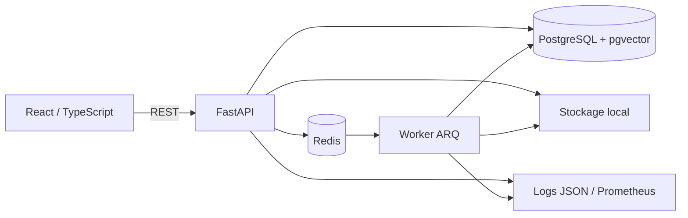

# EvidenceDesk

EvidenceDesk est un assistant local de revue de dossiers fournisseurs. Il importe des PDF texte,
TXT et Markdown synthétiques, les traite hors requête HTTP, extrait des champs traçables et répond
uniquement avec le document, la page et le passage utilisés. Quand la preuve manque ou se
contredit, il doit s'abstenir.

Le projet est une démonstration technique locale, pas un service utilisé par des clients. Deux jeux
holdout distincts ont échoué aux objectifs déclarés avant leurs runs archivés ; les résultats
négatifs sont conservés dans le dépôt au lieu d'être masqués. Les locks et hashes sont des contrôles
locaux, pas une preuve externe d'absence de consultation ou de réexécution.


## Public visé et parcours

Le scénario représente une équipe opérations qui vérifie un contrat fournisseur, un rapport
d'incident et un registre. Un administrateur peut se connecter, observer une tâche Redis/ARQ,
poser une question, ouvrir la citation exacte, consulter l'extraction et le journal d'audit, puis
voir les résultats d'évaluation réellement calculés.

- `admin` : lecture, import, questions, audit, état, évaluation et suppression ;
- `analyst` : lecture, import et questions ;
- `reader` : lecture, questions et extraction.

Les autorisations sont appliquées par FastAPI ; masquer un contrôle dans React ne remplace jamais
le contrôle serveur.

## Ce qui est réellement implémenté

- FastAPI typé, OAuth2 password flow, JWT de 30 minutes, Argon2 et RBAC serveur ;
- React/TypeScript responsive avec suivi des états, citations et extractions activables au clavier ;
- PostgreSQL 16, `pgvector`, index HNSW, `tsvector` et index GIN ;
- Redis et worker ARQ avec trois tentatives, états terminaux, idempotence par SHA-256 et corrélations ;
- stockage local derrière le protocole `DocumentStorage` ; un adaptateur objet/S3 peut le remplacer ;
- validation extension, signature, MIME, taille, UTF-8 et clé de stockage générée côté serveur ;
- limite du corps HTTP avant parsing multipart, y compris sans `Content-Length` ;
- budgets worker sur pages, caractères extraits et chunks, avec échec terminal explicite ;
- découpage par page/bloc, masquage e-mail/téléphone, extraction fournisseur avec citations par champ ;
- recherche hybride locale et réponse extractive, audit PostgreSQL, logs JSON et métriques Prometheus ;
- Docker Compose, tests pytest/Vitest/Playwright, axe-core et CI GitHub Actions préparée ;
- corpus synthétique CC0, jeux d'évaluation versionnés, hashes, fingerprint moteur et locks holdout.

Limite importante : le vecteur local est un feature hashing déterministe, pas un embedding
sémantique pré-entraîné. La pondération reste principalement lexicale. `pgvector` est utilisé, mais
le projet ne revendique donc pas une recherche sémantique de niveau production.

## Architecture



Le détail des flux, frontières et décisions est dans
[`docs/architecture.md`](docs/architecture.md) et [`docs/decisions/`](docs/decisions/).

## Démarrage Docker

Prérequis : Docker Engine avec Compose v2. Aucun compte ou clé de modèle n'est nécessaire.

```bash
git clone <URL_A_AJOUTER_APRES_PUBLICATION>
cd evidencedesk
docker compose up --build --wait --wait-timeout 180
docker compose ps
```

Sans dépôt publié, utiliser directement le chemin local de ce projet. L'interface écoute sur
`http://localhost:8080`, l'API sur `http://localhost:8000`, PostgreSQL sur `55432` et Redis sur
`56379`. Ces quatre publications sont liées à `127.0.0.1`, pas aux interfaces LAN.

Comptes de démonstration locaux :

| Rôle | Identifiant | Mot de passe local |
|---|---|---|
| Administrateur | `demo.admin` | `EvidenceDemo-Admin-2026!` |
| Analyste | `demo.analyst` | `EvidenceDemo-Analyst-2026!` |
| Lecteur | `demo.reader` | `EvidenceDemo-Reader-2026!` |

Ces valeurs sont publiques et réservées à la pile locale synthétique. Elles ne doivent jamais être
réutilisées lors d'un déploiement. Copier [`.env.example`](.env.example) et remplacer tous les
secrets avant toute exposition réseau.

Pour arrêter sans supprimer les volumes :

```bash
docker compose down
```

`docker compose down --volumes` efface uniquement les données EvidenceDesk locales ; ne l'utiliser
que lorsque la reconstruction du corpus synthétique est souhaitée.

## Windows et WSL2

La procédure vérifiée a été exécutée dans Ubuntu sous WSL2 avec Docker accessible depuis WSL :

```bash
cd ~/dev/evidencedesk
docker version
docker compose version
docker compose up --build --wait --wait-timeout 180
curl -fsS http://localhost:8080/health
```

Avec Docker Desktop, activer l'intégration WSL pour la distribution Ubuntu puis lancer ces commandes
dans le terminal WSL. Le lancement depuis un terminal Windows natif n'a pas été testé et n'est pas
présenté comme validé.

## Développement et tests

Backend :

```bash
uv sync --frozen --all-groups
uv run alembic upgrade head
uv run ruff check apps/api apps/worker evals scripts
uv run mypy apps/api/evidencedesk_api apps/worker/evidencedesk_worker
uv run python scripts/check_supply_chain_refs.py
uv run pytest --cov --cov-report=term-missing --cov-report=json:artifacts/coverage.json
uv run pip-audit --strict
```

Frontend :

```bash
cd apps/web
npm ci
npm run lint
npm run typecheck
npm run test
npm run build
npm audit --omit=dev --audit-level=high
```

Parcours réel Docker, y compris axe-core desktop/mobile :

```bash
cd apps/web
E2E_REAL_API=1 \
E2E_BASE_URL=http://127.0.0.1:8080 \
E2E_DEMO_ADMIN_PASSWORD='EvidenceDemo-Admin-2026!' \
npm run e2e -- --grep 'real stack'
```

La CI préparée dans [`.github/workflows/ci.yml`](.github/workflows/ci.yml) refait les vérifications
backend/frontend, les audits de dépendances, le scan de secrets et un vrai parcours
web → API → Redis/worker → PostgreSQL. Elle n'a pas été exécutée sur GitHub faute de publication.

## Évaluation reproductible

Le manifeste contient 40 cas : 25 répondables, 10 sans réponse et 5 ambigus/adversariaux, avec
21 cas de développement et 19 cas holdout. Les holdouts déjà ouverts ne doivent jamais être
relancés.

| Jeu | Paramètres | Citations rapportées | Abstention | F1 extraction | p95 | Verdict |
|---|---|---:|---:|---:|---:|---|
| Développement v1.2 | `extractive-local-v1.2-frozen` | 100,0 % | 100,0 % | 100,0 % | 0,533 ms | PASS développement |
| Holdout v2 | `extractive-local-v1.1-frozen` | 70,0 % | 80,0 % | 94,1 % | 1,976 ms | FAIL |
| Holdout v3 | `extractive-local-v1.2-frozen` | 50,0 % | 70,0 % | 33,3 % | 1,021 ms | FAIL |

L'audit indépendant v3 a montré que le matcher comptait les sous-chaînes comme citations exactes.
Avec une égalité littérale stricte, la précision v3 est 0/8 et non 4/8. Les 50,0 % restent affichés
comme résultat historique du runner gelé, pas comme précision exacte. L'évaluateur mesure le moteur
en mémoire ; il ne couvre pas la latence réseau, l'ingestion, PostgreSQL ou le worker.

Voir [`docs/evaluation.md`](docs/evaluation.md) et les JSON dans `artifacts/evaluations/`. La seule
commande autorisée sans nouveau protocole est la validation structurelle :

```bash
PYTHONPATH=apps/api:apps/worker:. uv run python -m evals.validate_dataset \
  datasets/blind_holdout_v3/evaluation_cases.json \
  --corpus datasets/blind_holdout_v3/corpus_manifest.json
```

## Modes IA

| Mode | État | Appel externe | Coût mesuré |
|---|---|---|---:|
| `extractive-local` | implémenté et utilisé | aucun | 0 USD |
| fournisseur local, par exemple Ollama | interface d'extension seulement | non implémenté | non mesuré |
| fournisseur compatible OpenAI | interface d'extension seulement | non implémenté | non mesuré |

Le mode actuel n'est pas un LLM complet. Aucun appel payant n'a été effectué. Un futur fournisseur
devra conserver les citations, l'abstention, la journalisation des erreurs et un coût explicite.

## Sécurité et données

- la démo refuse un import non attesté synthétique en `PUBLIC_DEMO_MODE=true` ;
- en mode public, seuls les quatre hashes synthétiques versionnés de l'allowlist sont importables ;
- les mots de passe sont hachés en base et les jetons restent en mémoire dans l'interface ;
- les documents ne sont jamais écrits dans les logs ; les erreurs exposent des codes assainis ;
- les e-mails et téléphones reconnus sont masqués avant indexation ;
- la suppression retire fichier, chunks et extraction, neutralise une tâche en cours et garde un
  audit minimal ;
- le worker borne pages, texte extrait et nombre de chunks ; suppression et persistance utilisent
  le même ordre de verrouillage ;
- nginx limite les uploads à 11 Mio, pose CSP, `nosniff`, anti-frame et `no-referrer` ;
- les ports Compose restent sur loopback et les actions/images externes sont épinglées à une
  révision immuable ;
- le Compose contient volontairement des identifiants de démonstration connus et n'est pas une
  configuration de production.

La politique de conservation, le modèle de menace et les limites sont détaillés dans
[`docs/security.md`](docs/security.md) et [`SECURITY.md`](SECURITY.md).

## Démonstration et exemples

- parcours de moins de trois minutes : [`docs/demo-script.md`](docs/demo-script.md) ;
- requêtes REST : [`docs/api-examples.md`](docs/api-examples.md) ;
- fichier d'import synthétique : [`examples/demo-supplier-note.md`](examples/demo-supplier-note.md) ;
- captures réelles : [`docs/screenshots/`](docs/screenshots/) ;
- preuve carrière et questions d'entretien : [`docs/career-proof.md`](docs/career-proof.md).

## Statut et limites connues

Statut : prototype local fonctionnel, avec résultat empirique `HONEST_NEGATIVE`.

- les objectifs holdout ne sont pas atteints ;
- le feature hashing échoue sur des formulations et domaines nouveaux ;
- le matcher historique de citation accepte une sous-chaîne, contrairement à son libellé « exact » ;
- les PDF image/OCR, tableaux complexes et documents chiffrés ne sont pas pris en charge ;
- la limite mémoire du sous-processus PDF est POSIX uniquement et la suppression
  fichier/transaction DB n'est pas atomique ;
- pas de multi-tenant, chiffrement applicatif, stockage S3 réel, LLM local ou fournisseur externe ;
- aucune CI distante, URL publique, charge concurrente ou procédure Windows native n'a été validée ;
- aucun utilisateur, client, témoignage ou SLA de production n'est revendiqué.

## Licence et contribution

Code sous licence [MIT](LICENSE). Le corpus de démonstration est marqué CC0-1.0. Voir
[`CONTRIBUTING.md`](CONTRIBUTING.md) et [`SECURITY.md`](SECURITY.md) avant toute contribution.
